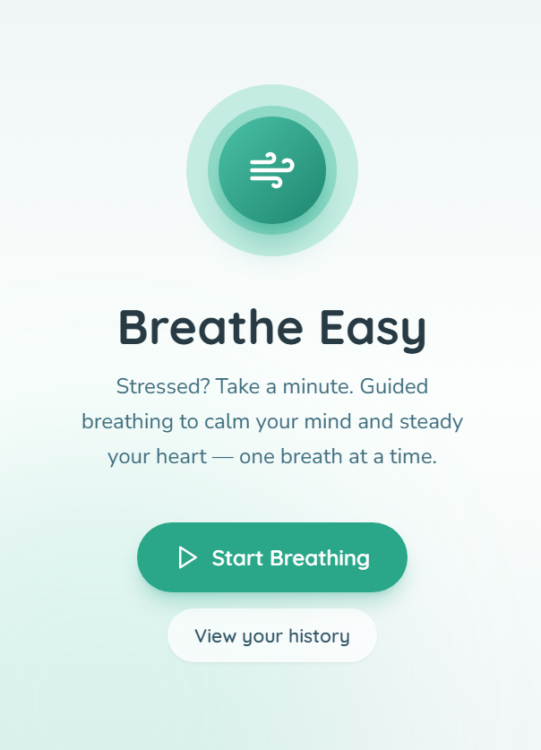
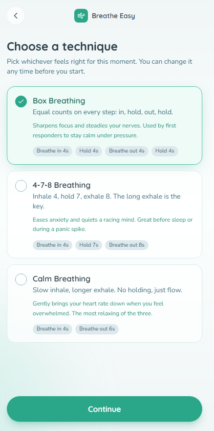
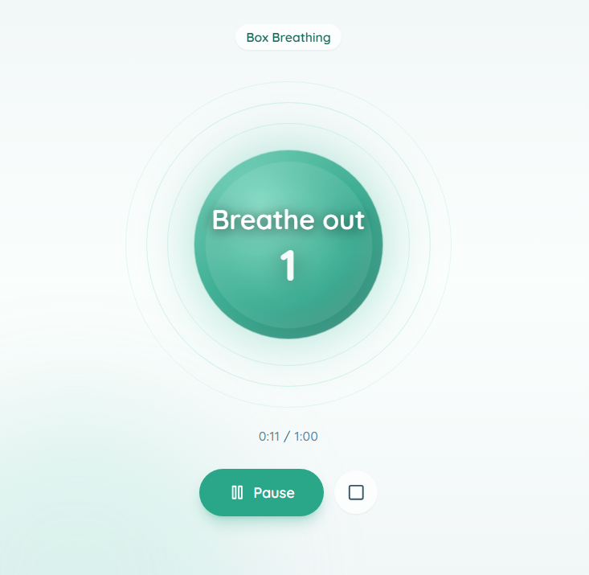
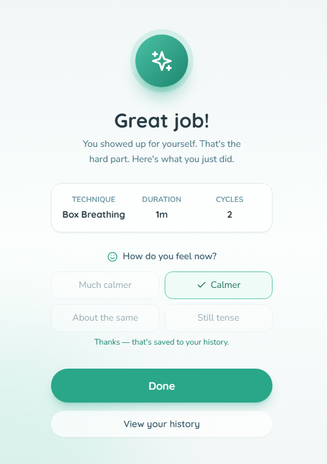

# Breathe Easy

A calm, guided breathing app to help you slow down and reset. Pick a technique, choose how long, and follow the animated breath cue. Completed sessions save to your history, with streaks and an optional mood check-in.

## Features

- **Three breathing techniques** — Box Breathing, 4-7-8 Breathing, and Calm Breathing, each with a short description and guidance on when to use it.
- **Guided breathing animation** — an expanding circle leads you through inhale, hold, and exhale phases with live text cues and a per-phase countdown. Pause, resume, end early, or restart.
- **Flexible session length** — 1, 3, or 5 minutes, or a custom duration from 1 to 30 minutes.
- **Mood check-in** — after each session, optionally log how you feel ("Much calmer", "Calmer", "About the same", "Still tense"). Your answer is saved with the session.
- **History & streaks** — track your day streak, total sessions, and total minutes, see your practice on a 12-week calendar heatmap, and review recent sessions (with the option to delete any entry).

## How it works

1. **Home** — welcome message, current streak, and a "Start Breathing" button.
2. **Pattern selection** — choose the breathing technique that fits the moment.
3. **Duration** — pick 1, 3, or 5 minutes, or set a custom length.
4. **Exercise** — follow the animated circle with on-screen cues. Pause or end early any time.
5. **Session complete** — a summary of what you just did, plus an optional mood check-in.
6. **History** — your stats, calendar heatmap, and a list of past sessions.

## Tech stack

- **React + TypeScript + Vite** — UI and build tooling.
- **Tailwind CSS** — styling and the calm visual theme.
- **lucide-react** — icons.
- **Supabase (PostgreSQL)** — stores breathing sessions, with Row-Level Security isolating each browser's data.

## Data & privacy

The app has no sign-in. Instead, each browser generates a stable device id (stored in `localStorage`) and sends it as the `x-device-id` header on every database request. Row-Level Security policies in Supabase compare each session's `device_id` against that header, so a browser can only read, insert, update, or delete its own sessions.

This is the strongest isolation possible without adding accounts, but it is inherently weaker than real auth — a determined client that spoofs another device's header could read that device's data. If you ever want true per-user privacy, the next step would be adding sign-in and scoping rows to `auth.uid()`.

## Database

The `breathing_sessions` table holds one row per completed session:

| column             | type      | notes                                            |
| ------------------ | --------- | ------------------------------------------------ |
| `id`               | uuid      | primary key, auto-generated                      |
| `device_id`        | text      | the browser's device id (from the request header)|
| `pattern`          | text      | the technique name, e.g. "Box Breathing"         |
| `duration_seconds` | integer   | actual session length in seconds                 |
| `feeling`          | text      | optional post-session mood (nullable)            |
| `completed_at`     | timestamptz | defaults to `now()`                            |

RLS is enabled, with four policies (one per CRUD verb) scoped by `device_id` via the `get_request_header('x-device-id')` helper function, which reads the value from PostgREST's `request.headers` JSON blob.

## Project structure

```
src/
  App.tsx                    # screen navigation
  screens/
    HomeScreen.tsx           # welcome + start
    PatternScreen.tsx        # technique selection
    DurationScreen.tsx       # session length
    ExerciseScreen.tsx       # animated breathing guide
    CompleteScreen.tsx       # summary + mood check-in
    HistoryScreen.tsx        # stats, heatmap, session list
  components/
    BreathingCircle.tsx      # the animated breath circle
    CalendarHeatmap.tsx      # 12-week practice calendar
    ScreenShell.tsx          # shared layout + buttons
  hooks/
    useBreathingEngine.ts    # breathing phase/animation logic
    useSessionHistory.ts     # load/save sessions from Supabase
  lib/
    patterns.ts              # breathing techniques, durations, moods
    supabase.ts              # supabase client + device id
supabase/
  migrations/                # SQL migrations (table + RLS)
```

## Local development

Install dependencies and run the dev server:

```bash
npm install
npm run dev
```

Build for production:

```bash
npm run build
```

Type-check:

```bash
npm run typecheck
```

Supabase credentials are pre-populated in `.env` — no manual configuration needed.

# Project Report — Breathe Easy

> A calm, guided breathing companion that helps you slow down, reset, and build a daily practice — one breath at a time.

---

## a. What it is and the problem it solves

**App name:** Breathe Easy

**What it does:** A guided breathing app that walks you through proven breathing techniques with an animated breath cue, tracks your sessions, and builds a gentle streak-based habit over time.

**The real problem it solves (and for whom):**
Stress, anxiety, and overstimulation are daily realities for most people, yet few have a fast, low-friction way to reset in the moment. Meditation apps demand 10+ minutes and a learning curve. A breathing exercise is the shortest path from "racing mind" to "steady" — but without a guide, most people breathe unevenly and give up.

Breathe Easy is built for **anyone who needs a 1–5 minute reset during a stressful day** — a student before an exam, a parent between tantrums, a developer between incidents, someone trying to fall asleep, or anyone managing anxiety. You open it, pick a technique, and a circle breathes with you. That's it. No accounts, no setup, no friction.

---

## b. Live deployed URL

**Live URL:** https://breathe-easy-web-app-njvg.bolt.host/

---

## c. Features — everything the app can do

### Breathing
- **Three guided techniques**, each with a description and a note on when to use it:
  - **Box Breathing** — equal 4-count inhale, hold, exhale, hold. Sharpens focus and steadies nerves; used by first responders.
  - **4-7-8 Breathing** — inhale 4, hold 7, exhale 8. Eases anxiety and quiets a racing mind; great before sleep.
  - **Calm Breathing** — slow inhale, longer exhale, no holding. Gently lowers heart rate when overwhelmed.
- **Animated breath guide** — an expanding/contracting circle leads every phase, with live text cues ("Breathe in", "Hold", "Breathe out") and a per-phase countdown.
- **Session lengths** — quick picks of 1, 3, or 5 minutes, plus a **custom duration from 1 to 30 minutes**.
- **Full playback control** — pause, resume, end early, or restart a session mid-breath.

### After each session
- **Session summary** — technique used, actual duration, and number of breath cycles completed.
- **Mood check-in** — optionally log how you feel afterward: "Much calmer", "Calmer", "About the same", or "Still tense". Saved with the session.

### History & habits
- **Day streak** — consecutive days with at least one session.
- **Totals** — total sessions completed and total minutes practiced.
- **12-week calendar heatmap** — a GitHub-style grid showing every day you practiced, so progress is visible at a glance.
- **Recent sessions list** — each entry shows the technique, duration, time ago, and your logged mood, with the ability to **delete any session**.

### Experience & privacy
- **No sign-in required** — the app works instantly. Each browser is silently assigned a stable device id so its data stays separate from other browsers.
- **Calm, focused design** — soft gradients, a single primary color, gentle animations, and a layout that removes everything except the breath.
- **Fully responsive** — works from small phones up to desktop.
- **Graceful offline behavior** — if a session can't be saved (e.g. no connection), the app tells you plainly and still credits the moment.

---

## d. The AI feature

**This app does not currently include an AI feature.** It is intentionally a focused, distraction-free breathing tool — the whole point is to pull you *away* from your screen and into your body, so we deliberately kept it AI-free.

---

## e. Tools, services, and AI models used to build it

| Layer | Tool / Service | Purpose |
| --- | --- | --- |
| Build tooling | **Vite** | Dev server + production bundling |
| UI framework | **React 18 + TypeScript** | Components and type-safe logic |
| Styling | **Tailwind CSS** | The calm visual theme, responsive layout, animations |
| Icons | **lucide-react** | All icons used across screens |
| Database | **Supabase (PostgreSQL)** | Stores breathing sessions with Row-Level Security |
| Auth model | Per-device id (no accounts) | Each browser's data is isolated via the `x-device-id` request header + RLS policies |
| Hosting / platform | **Bolt** | Project scaffold, live preview, and deployment |

**AI models used to build it:** The app's code was generated with **Claude** (Anthropic), running inside Bolt's AI-assisted development environment. No AI model runs *inside* the deployed app itself — all logic is deterministic React/TypeScript and SQL.

---

## f. Screenshots of the app in action


### 1. Home — your daily landing page
Shows the welcome message, your current day streak, and the single "Start Breathing" call to action that gets you into a session in one tap.


### 2. Choose your technique
The three breathing patterns presented as cards, each with a short description and a note on when it helps.


### 3. Mid-breath — the animated guide
The breathing circle mid-expansion with a live cue ("Breathe in") and countdown. Pause and end-early controls are visible.


### 4. Session complete + mood check-in
The summary (technique, duration, cycles) and the four mood options you can tap to log how you feel.

---

## g. How to run the project

### Prerequisites
- **Node.js** (v18 or newer)
- **npm** (comes with Node)

### Install and run locally
```bash
# 1. Install dependencies
npm install

# 2. Start the dev server (hot reload)
npm run dev
```
Then open the URL Vite prints (usually `http://localhost:5173`) in your browser.

### Other commands
```bash
# Production build (outputs to dist/)
npm run build

# Preview the production build locally
npm run preview

# Type-check the project
npm run typecheck

# Lint
npm run lint
```

### Environment
Supabase credentials (`SUPABASE_URL`, `SUPABASE_ANON_KEY`, etc.) are **pre-populated in the project's `.env`** — no manual configuration is needed to run locally. The database schema and Row-Level Security policies are already applied via Supabase migrations.

### Data & privacy notes
- The app has **no sign-in**. Each browser gets a stable device id (stored in `localStorage`) sent as the `x-device-id` header on every request.
- Supabase **Row-Level Security** compares each session's `device_id` against that header, so a browser can only read, insert, update, and delete its *own* sessions.
- This is the strongest isolation available without adding accounts. If you ever want true per-user privacy, the next step would be adding sign-in and scoping rows to `auth.uid()`.

---

*Built as a focused, production-quality breathing companion. Calm by design.*
